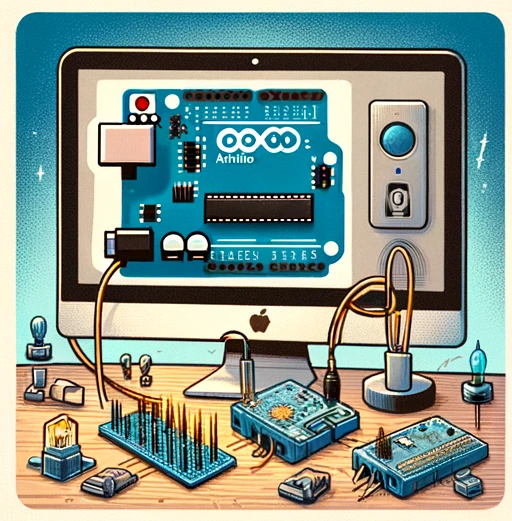
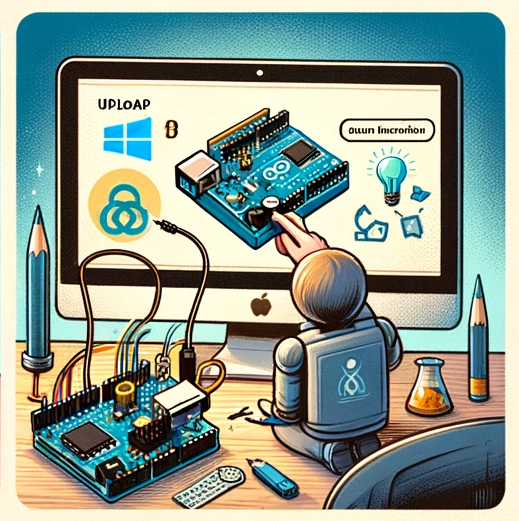
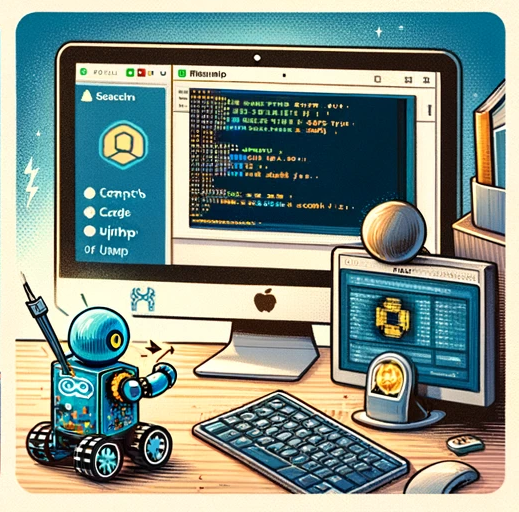

# Robot App

## Intro

Control and connect with your Otto robot model effortlessly, featuring interactive tutorials and a dedicated forum for community communication.

## Funcional Description

### Use Cases

Admin 
- user management (v1)
- forum moderation (v1)
- publish tutorials
- content management

User
- connect to robot
- send movement order to robot (left/right...)
- save movement order (histograma)
- view movement orders
- update movement order ordinal
- execute movement orders 
- acces to tutorials 
- save tutorial (v1)
- fav tutorial / post forum (v0/v1)
- user profile
- private messaging (v1)

## Tecnical Description

### Data Model

User
- id (String)
- name (String)
- email (String)
- password (String)
- robot model (String)
- role (enum) [Admin, User] 

Movement
- id (String)
- name (String)
- type (enum ['forward', 'backward', 'left', 'right', 'jump', 'turnRight', 'turnLeft', 'stop', 'snakeMove', 'crusaito', 'moonwalker', 'swing', 'shakeLegLeft', 'shakeLegRight', 'noGravity', 'kickLeft', 'upDown'])
- ordinal (number)
- steps (Number)
- T (Number)
- h (Number)
- dir (String)
- tempo (Number)

Sequence Movement
- userId (user.id)
- movements (array of Movement)
- createdAt (Data)

Tutorial
- id (String)
- author (String)
- title (String)
- text (String)
- likes (array of user.id)

Post in Forum (v1)
- id (String)
- author (String)
- body message (String)
- comments (String)
- favs (array of user.id)

### Technologies

- Database: MongoDB
- Backend: Node.js | Express
- Frontend: HTML | React | Tailwind | TinyMCE
- Testing: Mocha y Chai
- Connection with Arduino: Firmata | Johnny-five

 

